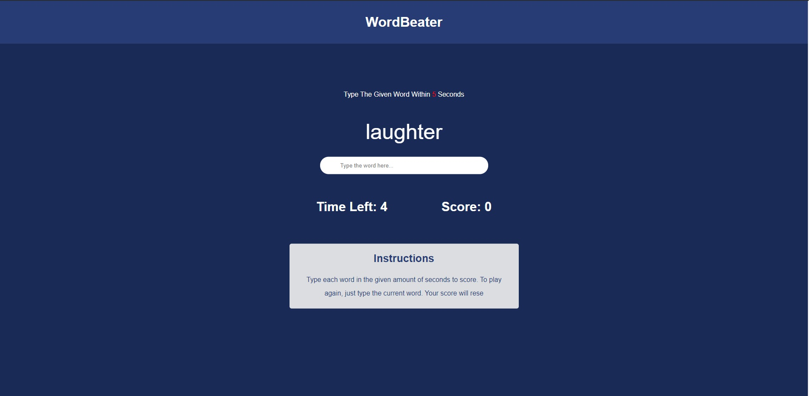

<!-- PROJECT LOGO -->
<br />
<p align="center">
  <a href="https://github.com/vildanhakanaj/worderbeater.git">
    
  </a>

  <h3 align="center">Word Beater</h3>

  <p align="center">
    This project was from Traversy Media
    <br />
    <br />
    <a href="https://vildanhakanaj.github.io/WordBeater/">View Demo</a>
    ·
    <a href="https://github.com/vildanhakanaj/wordbeater.git/issues">wordbeater.gitrt Bug</a>
    ·
    <a href="https://github.com/vildanhakanaj/wordbeater.git/issues">Request Feature</a>
  </p>
</p>


<!-- TABLE OF CONTENTS -->
## Table of Contents

* [About the Project](#about-the-project)
  * [Built With](#built-with)
* [Getting Started](#getting-started)
  * [Installation](#installation)
* [Roadmap](#roadmap)
* [Contributing](#contributing)
* [License](#license)
* [Contact](#contact)
* [Acknowledgements](#acknowledgements)

<!-- ABOUT THE PROJECT -->
## About The Project

This is a basic game called word beater. The users goal is to write the word that is randomly picked from an array of words within the time specified. 
If the user writes the word before the timer, the timer will reset and they will gain a point. 
If the user fails to write the word before the clock runs out the game stops and game over is displayed reseting the score and time.

### Built With

* [Html 5]
* [CSS 3]
* [Javascript]


<!-- GETTING STARTED -->
## Getting Started

To get a local copy up and running follow these simple steps.

### Prerequisites
* npm
```sh
npm install npm@latest -g
```
### Installation
 
1. Clone the wordbeater.git
```sh
git clone https://github.com/vildanhakanaj/wordbeater.git.git
```
2. Install NPM packages
```sh
npm install
```
<!-- ROADMAP -->
## Roadmap

See the [open issues](https://github.com/vildanhakanaj/wordbeater.git/issues) for a list of proposed features (and known issues).

<!-- CONTRIBUTING -->
## Contributing

Contributions are what make the open source community such an amazing place to be learn, inspire, and create. Any contributions you make are **greatly appreciated**.

1. Fork the Project
2. Create your Feature Branch (`git checkout -b feature/AmazingFeature`)
3. Commit your Changes (`git commit -m 'Add some AmazingFeature'`)
4. Push to the Branch (`git push origin feature/AmazingFeature`)
5. Open a Pull Request

<!-- LICENSE -->
## License

Distributed under the MIT License. See `LICENSE` for more information.

<!-- CONTACT -->
## Contact

Your Name - [@anihakanaj](https://instagram.com/anihakanaj) - vildanhakanaj@trentu.ca

Project Link: [https://github.com/vildanhakanaj/wordbeater.git](https://github.com/vildanhakanaj/wordbeater.git)


<!-- ACKNOWLEDGEMENTS -->
## Acknowledgements

* [Traversy Media](https://www.youtube.com/user/TechGuyWeb)
* [Read Me Template](https://github.com/othneildrew/Best-README-Template/blob/master/README.md)
